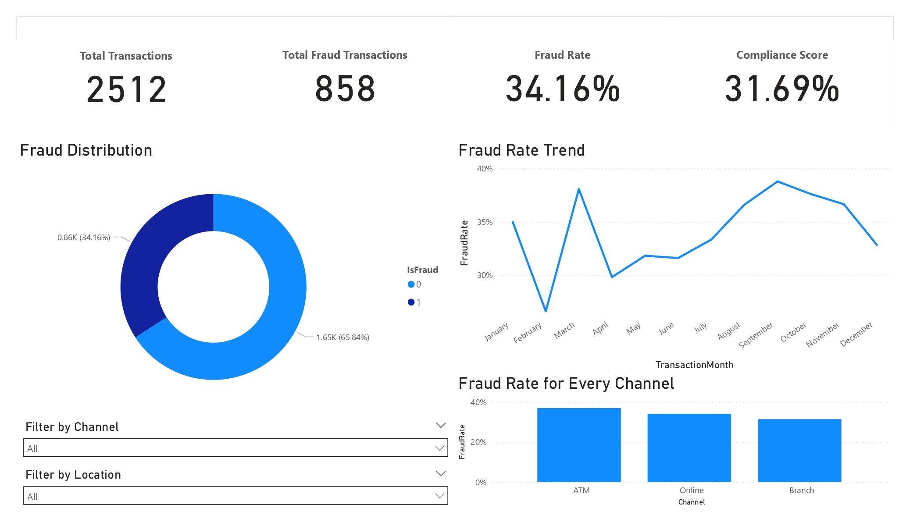
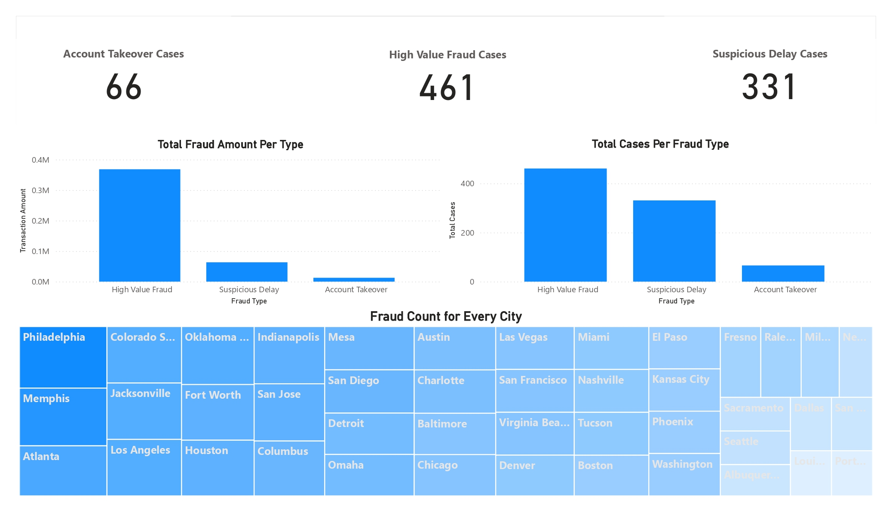
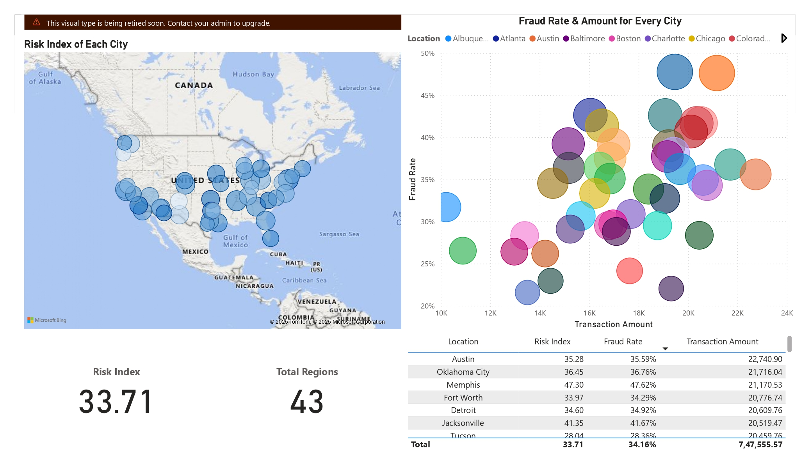

# Financial Risk & Compliance Dashboard

A Power BI dashboard designed for banking risk monitoring, compliance reporting, and real-time fraud intelligence.
This solution delivers a unified view of fraud trends, risk exposure, and compliance metrics across multiple regions and channels, enabling faster decision-making and reducing reporting effort by 30%.

The dashboard tracks fraud patterns across 5+ KPIs, including transaction volumes, fraud distribution, compliance score, risk index, and city-level heatmaps.

## Key Features
### 1. Executive Overview (Page 1)

- Total Transactions, Fraud Transactions, Fraud Rate, and Compliance Score.
- Fraud distribution across fraudulent vs non-fraudulent transactions.
- Fraud Rate Trend across months.
- Fraud Rate by Channel (ATM, Online, Branch).
- Dynamic filters for channel and location.

### 2. Fraud Analytics (Page 2)

- Total Fraud Amount per Type (High Value Fraud, Suspicious Delay, Account Takeover).
- Total Cases per Fraud Type.
- City-wise Fraud Count heatmap (Philadelphia, Memphis, Atlanta, etc.).
- Summary KPIs for each fraud type:
- Account Takeover: 66 cases
- High Value Fraud: 461 cases
- Suspicious Delay: 331 cases

### 3. Regional Risk Insights (Page 3)

- Risk Index of each U.S. city plotted on a map.
- A scatter plot comparing Fraud Rate vs Transaction Amount for each location.
- Detailed table summarizing Risk Index, Fraud Rate, and Transaction Amount for all 40+ regions.
- Total Risk Index: 33.71
- Total Regions: 43

## Dataset Used

CSV file: `bank_transactions_data_2.csv`

Contains fields for (example based on visuals & typical banking risk datasets):
- Transaction ID
- Customer Details
- Location (City, State)
- Channel (ATM, Online, Branch)
- Transaction Amount
- Date / Month
- IsFraud flag
- Fraud Type (High Value, Suspicious Delay, Account Takeover)
- Risk Index (derived metric)

This data powers all KPI cards, heatmaps, trend charts, and drill-downs.

## Business Problem Solved

Banks face increasing regulatory pressure to detect fraud early, monitor operational risks, and maintain compliance with internal controls. Traditional reporting is slow and fragmented.

This dashboard solves these gaps by:
- Providing real-time visibility into fraud patterns.
- Highlighting high-risk locations and fraud types.
- Offering a single source of truth for compliance reporting.
- Enabling risk officers to identify trends early and act proactively.
- Reducing manual report preparation effort by 30%.

## Dashboard Pages
**Page 1: Executive Overview**



**Page 2: Fraud Analytics**



**Page 3: Regional Risk Insights**



## How to Use

1. Open the .pbix file using Power BI Desktop (latest version).
2. Connect/refresh the dataset if needed.
3. Use slicers to filter by:
   - Channel
   - Region
   - Month
   - Fraud Type

4. Hover over visuals to view detailed tooltips.
5. Use drill-through and cross-filter interactions for deeper insights.

## Installation

1. Clone the repository:
    ```
    git clone https://github.com/Hrishi1084/Financial-Risk-Compliance-Dashboard.git
    ```

2. Open `Financial_Risk_&_Compliance_Dashboard.pbix` in Power BI Desktop.

3. Ensure the dataset `(bank_transactions_data_2.csv)` is in the correct relative path.

4. Refresh the report.

## Folder Structure

    /
    |-- README.md
    |-- Financial_Risk_&_Compliance_Dashboard.pbix
    |-- bank_transactions_data_2.csv

## Author

**Hrishikesh Suryawanshi**